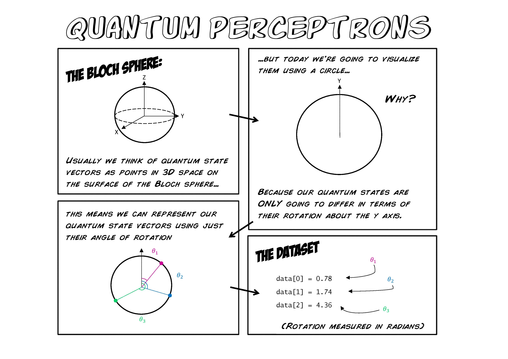
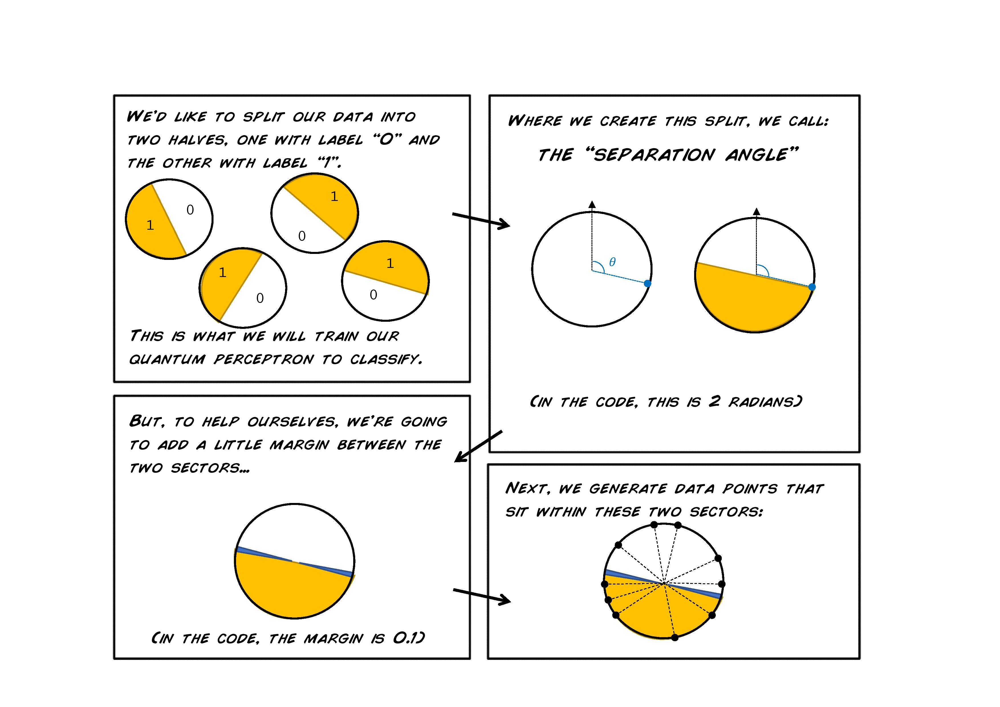
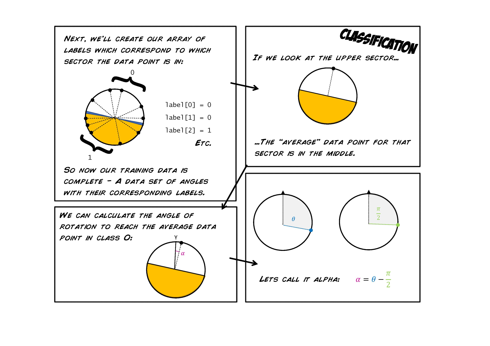
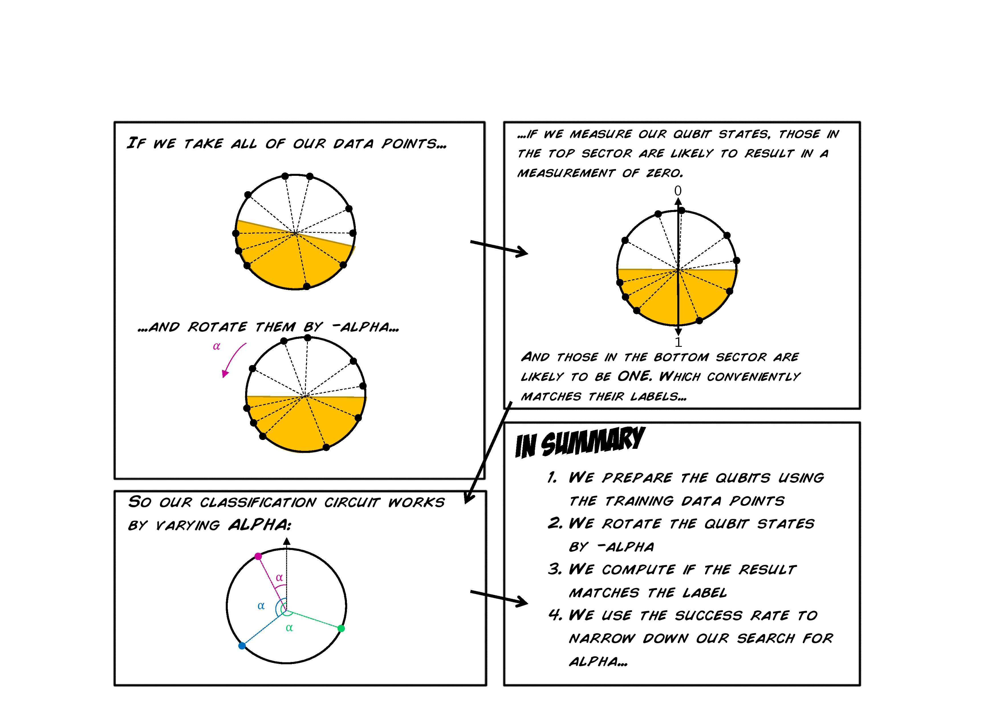

# Quantum Perceptrons

> This post is part of the [Q# Advent Calendar](https://blogs.msdn.microsoft.com/visualstudio/2018/11/15/q-advent-calendar-2018/) series.

This comic explains the process of implementing a quantum perceptron, from creating a dataset through to classification of that data. It’s been written to accompany the code from [this workshop](https://github.com/Microsoft/MLADS2018-QuantumML) on an ‘Introduction to Quantum Machine Learning’, so I recommend you take a look at that first!

Thanks for reading!

## Further Resources

- Quantum Machine Learning workshop [link](https://github.com/Microsoft/MLADS2018-QuantumML)
- A review of Quantum Machine Learning [link](https://arxiv.org/pdf/1611.09347.pdf)
- Learn Q# and Quantum Computing through programming exercises [link](https://github.com/Microsoft/QuantumKatas)
- Updates from Microsoft Quantum [link](https://twitter.com/MSFTQuantum)